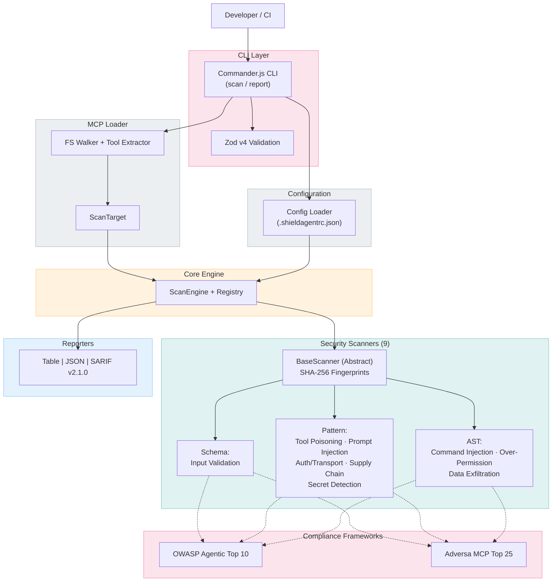

# ShieldAgent Architecture

## System Overview

## Scanner Inventory

| # | Scanner | Category | Key Rules |
|---|---------|----------|-----------|
| 1 | Input Validation | schema | IV001–IV006 |
| 2 | Tool Poisoning | pattern | TP001–TP005 |
| 3 | Prompt Injection | pattern | PI001–PI004 |
| 4 | Auth / Transport | pattern | AT001–AT004 |
| 5 | Supply Chain | pattern | SC001–SC005 |
| 6 | Command Injection | ast | CI001–CI005 |
| 7 | Over-Permission | ast | OP001–OP005 |
| 8 | Data Exfiltration | ast | DE001–DE005 |
| 9 | Secret Detection | pattern | SD001–SD004 |

## Compliance Frameworks

### OWASP Agentic Top 10
| ID | Name |
|----|------|
| AT-01 | Tool Poisoning |
| AT-02 | Prompt Injection |
| AT-03 | Command Injection |
| AT-04 | Over-Permission |
| AT-05 | Data Exfiltration |
| AT-06 | Improper Input Validation |
| AT-07 | Missing Authentication |
| AT-08 | Credential Exposure |
| AT-09 | Supply Chain Compromise |
| AT-10 | Insecure Transport |

### Adversa MCP Top 25 (mapped)
| ID | Name |
|----|------|
| MCP-01 | Tool Poisoning Attack |
| MCP-02 | Rug Pull via Tool Modification |
| MCP-03 | Tool Shadowing |
| MCP-04 | Prompt Injection via Tool Description |
| MCP-05 | Command Injection via Tool Input |
| MCP-06 | Data Exfiltration via Tool |
| MCP-07 | Credential Leakage in Tool Definitions |
| MCP-08 | Lack of Authentication |
| MCP-09 | Insecure Transport |
| MCP-10 | Excessive Permissions |
| MCP-14 | Missing Input Validation |
| MCP-20 | Malicious npm Package |
| MCP-21 | Typosquatting Attack |
